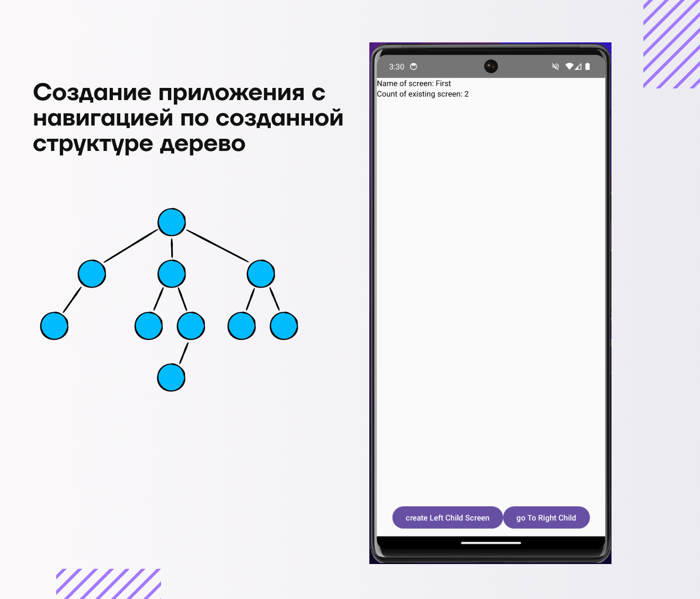

# Тестовое задание от компании De Net

## Описание тестового задания:

1. Создать структуру дерева, состоящую из узлов (Node) имеющих, название, детей и ссылку на родителя (такие же узлы)
2. Написать приложение состоящее из одного экрана с рекурсивной навигацией внутри этого дерева. (Первый экран открывает корневой уровень (root) и далее мы можем пройти в экраны childs)
3. Добавить возможность создания и удалений сущностей на каждом уровне
4. Сохранять состояние дерева на устройстве и подтягивать при следующем входе
5. Название формировать из последних 20 байт хэша узла по аналогии с адресом кошельков Ethereum

## Что уже сделал и что понял

- На данный момент реализована струтура данных дерево через data class а также добавлена навигация с помощью jetpack navigation. Для UI использовал jetpack compose. В общем есть первичная версия приложения, но нет сохранения нормального при поворотах и при выходе. Думал смогу реализовать через remember в jetpack но не получилось(

## Что нужно сделать

1. добавить полноценный state holder для сохранения состояния при поворотах + убрать после этого всю логику с UI
2. добваить и реализовать room в приложение для сохранения данных при выходе
